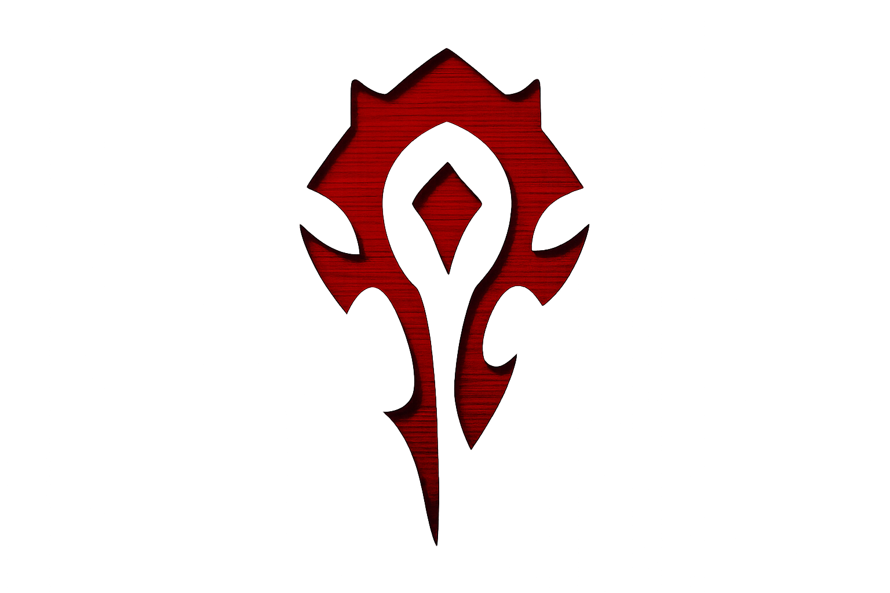
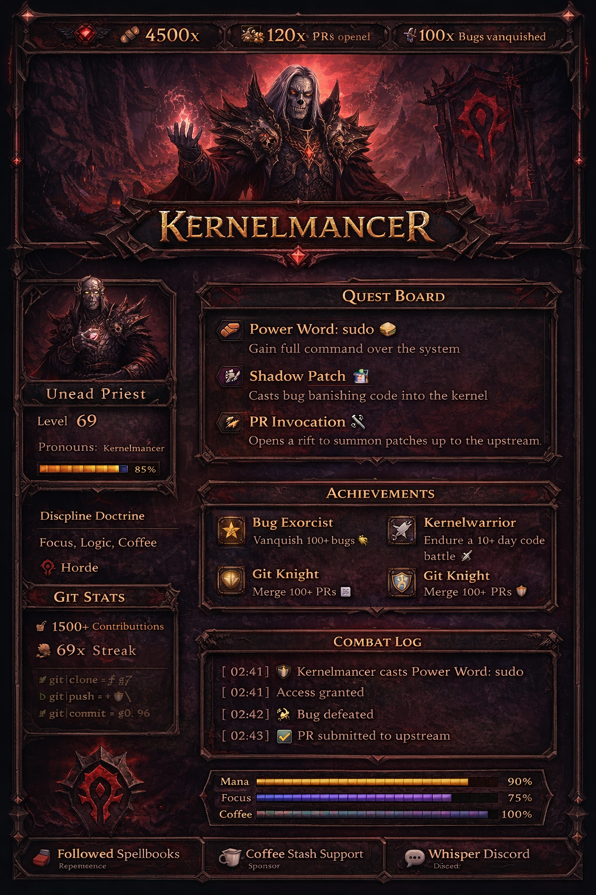

<h1 align="center">
  
  Kernelmancer
  
</h1>
<h3 align="center">Undead Discipline Priest of the Horde</h3>

<i>Systems mage • Patchcrafter • Keeper of uptime</i>

  
  
  
  
  

  

---

<table width="100%">
<tr>
<td width="55%" valign="top">

## 🧙 Character Profile

| Attribute | Value                                    |
| --------- | ---------------------------------------- |
| Race      | Undead                                   |
| Class     | Priest                                   |
| Spec      | Discipline                               |
| Faction   | Horde ⚔️                                 |
| Guild     | Manifest IT                              |
| Role      | Damage mitigation & system stabilization |
| Alignment | Chaotic Useful                           |

> Once raised from the ruins of failed deployments and cursed YAML, the Kernelmancer swore no broken config would go unpunished.
> In daylight, he walks among users and systems. By night, he fades into terminal glow — shielding services, routing packets, and binding unstable infrastructure back into order.

</td>
<td width="45%" align="center" valign="top">

</td>
</tr>
</table>

> Once raised from the ruins of failed deployments and cursed YAML, the Kernelmancer swore no broken config would go unpunished.
> In daylight, he walks among users and systems. By night, he fades into terminal glow — shielding services, routing packets, and binding unstable infrastructure back into order.

---

## ⚔️ Spellbook

| Ability                        | Effect                                                   |
| ------------------------------ | -------------------------------------------------------- |
| **Power Word: sudo**           | Grants temporary absolute control over the system.       |
| **Power Word: Shield (Infra)** | Absorbs incoming failures before they reach production.  |
| **Penance (Debugging)**        | Rapid bursts of precise fixes applied in sequence.       |
| **Mind Vision: Root Cause**    | Reveals the one cursed line responsible for everything.  |
| **Daemon Form**                | Operates silently in background processes after dark.    |
| **PR Invocation**              | Transforms bugs and chaos into clean upstream patches.   |
| **Shadow Patch**               | Hotfix deployed before anyone notices the issue existed. |

---

## 🧩 Tech Domains

**Linux** ▰▰▰▰▰▰▰▰▰▰ 100% 
**Networking** ▰▰▰▰▰▰▰▰▰▱ 92% 
**Infrastructure** ▰▰▰▰▰▰▰▰▰▱ 91% 
**Debugging** ▰▰▰▰▰▰▰▰▱▱ 88% 
**Automation** ▰▰▰▰▰▰▰▰▱▱ 84%

---

## 🗺️ Quest Board

* 🟢 Entered the open-source arena
* 🟢 First PRs merged
* 🟡 Expanding mihomo / clash contributions
* 🔴 Earn repeated upstream merges
* 🔴 Become legendary maintainer

---

## 🧰 Toolkit

* 🐧 Linux / Ubuntu
* 🌐 Networking / proxies / routing
* ☁️ ESXi / virtualization
* 🧠 Home Assistant
* 🗄️ PostgreSQL / 1C
* 🤖 Local LLMs

---

## 🏆 Achievements

* 🏅 **First PR** — entered the open-source arena
* 🛠️ **Bug Exorcist** — removed cursed configs
* 🌙 **Daemonwalker** — active when others sleep
* 🔧 **Patchbinder** — turns issues into commits
* ⚔️ **Infra Guardian** — maintains system stability

---

## 📜 Tavern Bio

sudo make me a sandwich 🥪
casting patches into the kernel ✝️
root by day, daemon by night 🌙
for the horde ⚔️

---

## 📡 Raid Status

  

  

---

  <h3>✝️ Discipline above chaos ⚔️</h3>
  
<b>For the Horde. For uptime.</b>

